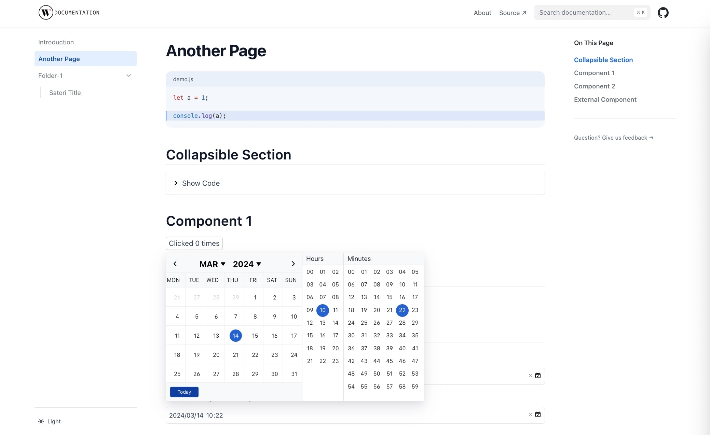

# Nextjs Doc Template

 A documentation template based on NextJS and Nextra that exports pure HTML files.




## Getting Started

Make sure if NODEJS is installed on your computer.

### Install  Dependencies:

```sh
$ npm install
```

### Run Project in development mode:

```sh
$ npm run dev
```
With is command file will be compiled and it will be loaded on local server [http://localhost:3000](http://localhost:3000).


### Production Build :

```sh
$ npm run build 
```
### Start a Next.js production server:

```sh
$ npm run start
```


### Export your Next.js application to static HTML

> Pure HTML Static Files (**.html**) 


**Step 1. generate static resources:**
```sh
$ npm run export
```

**Step 2. fix name for HTML files:**
```sh
$ npm run export:fix
```


## Contributing

- [React](https://reactjs.org/)
- [nextjs](https://nextjs.org/)
- [Nextra](https://nextra.site/)
- [Funda UI](https://github.com/xizon/funda-ui) - for External Component Test


## Supported development environment

- Nextra 2+
- Next.js 14+
- React 18 +
- TypeScript 4.x.x + 


## Licensing

Licensed under the [MIT](https://opensource.org/licenses/MIT).

